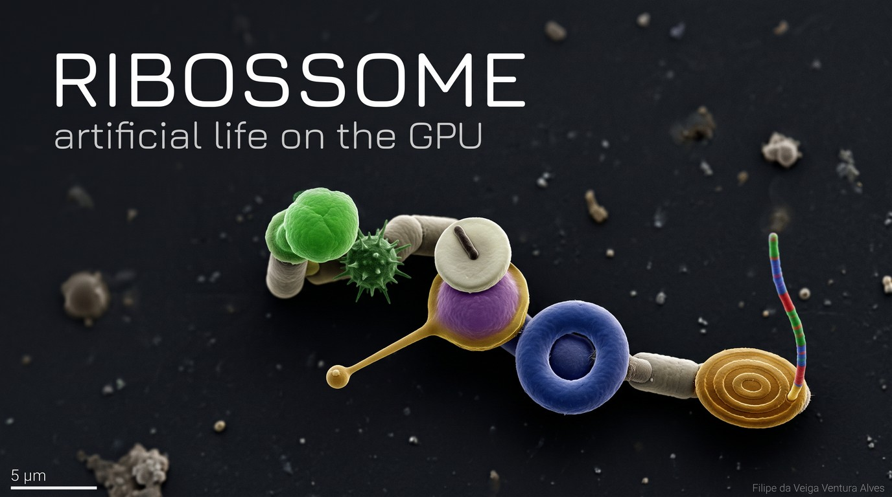
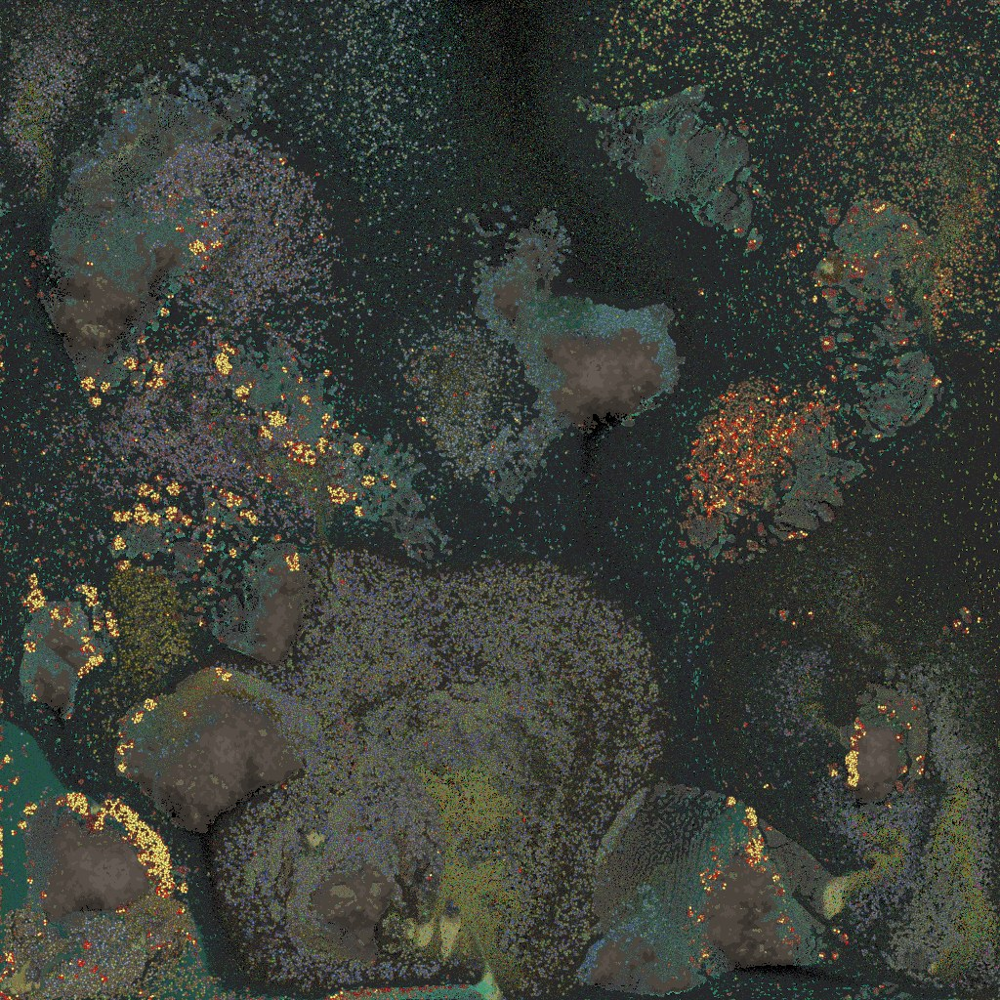
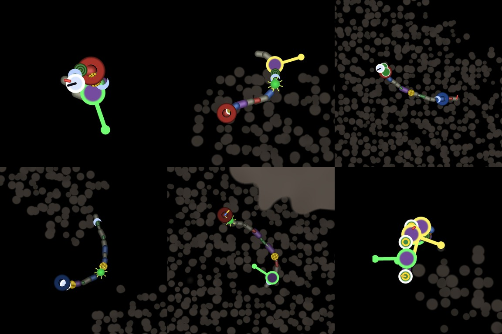
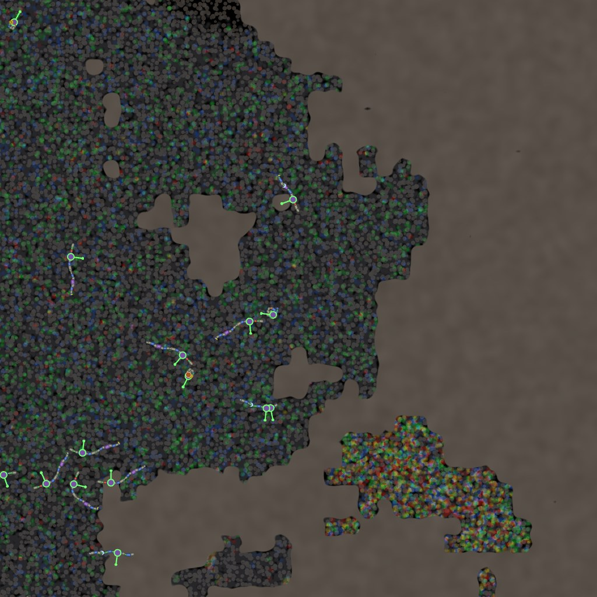
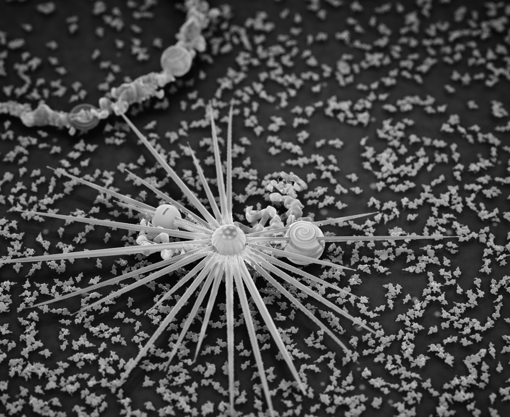
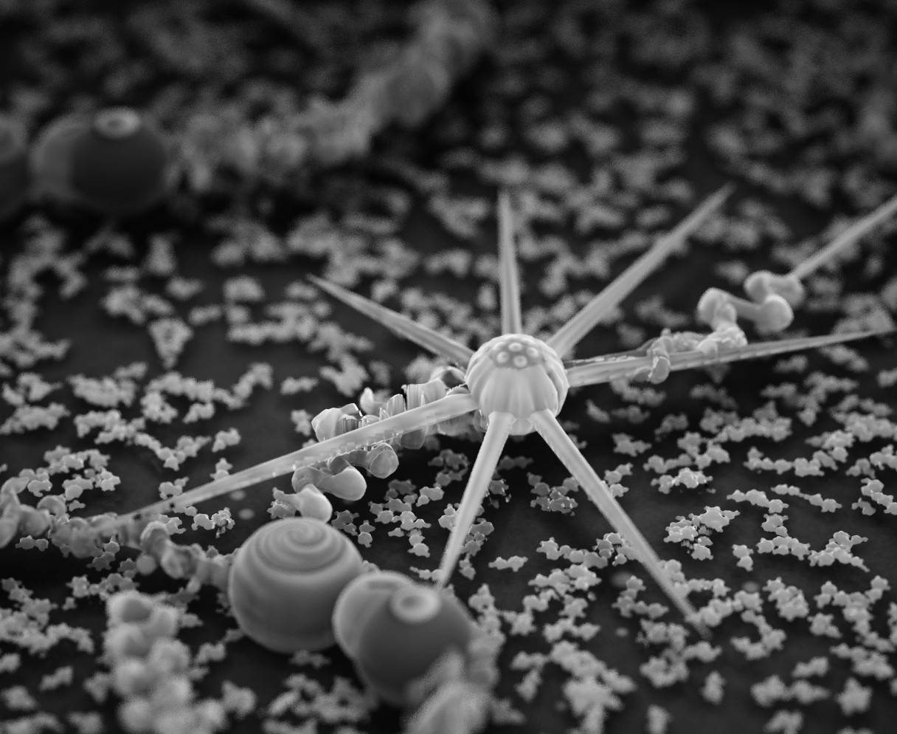
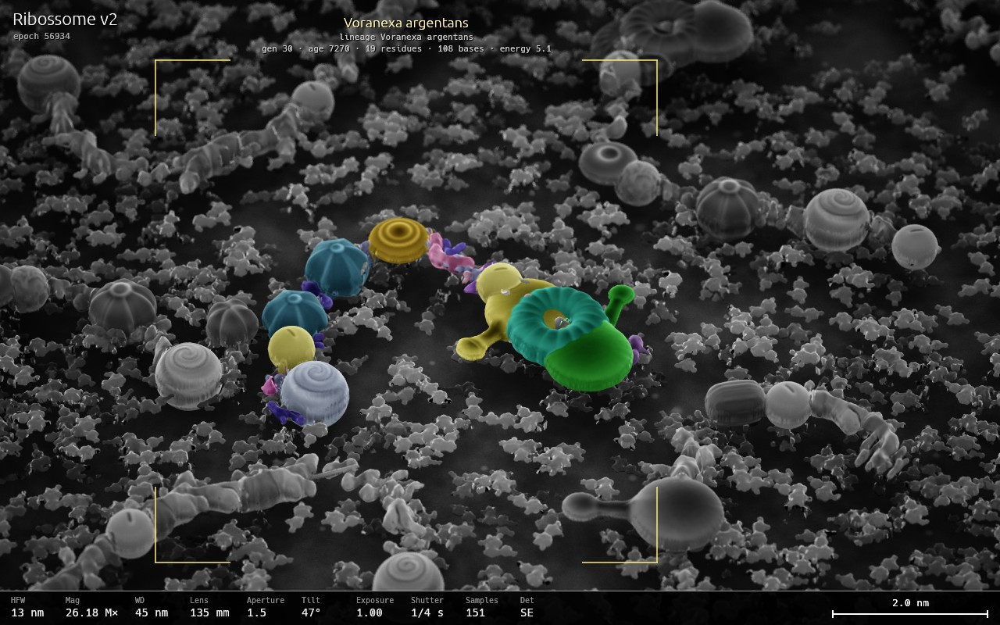
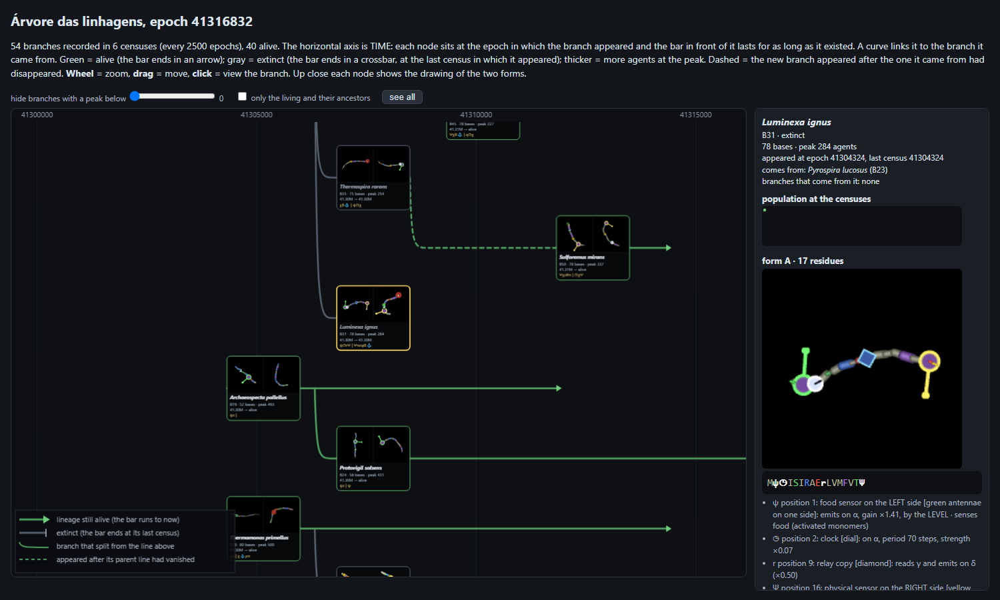

# Ribossome



**Artificial life on the GPU.** A closed 2D water world where organisms made
of RNA and protein evolve through chemistry, not through designed rules.
Written in Rust with wgpu and WGSL; everything (world, creatures, drawing)
runs on the graphics card.

*The interface is in English. Code comments, table keys and working notes
are in Portuguese.*



*A world after forty million steps: rock and rubble, vents at the bottom,
light from above, and colonies of different lineages.*

## The idea

- **Exact matter.** The world is closed. Monomers (A, U, G, C) are whole
  units that only change place; nothing creates or destroys them. A test
  checks it.
- **The same chemistry for everyone.** What an organism can do comes from
  global chemical rules. Its sequence only decides where and how much.
- **Organisms do not know genomes.** No rule compares one agent's genome
  with another's.
- **Replication by pairing.** An agent copies itself base by base with
  activated monomers taken from the water. The child is the reverse
  complement of the parent, so every lineage has two forms that alternate.
- **Low Reynolds number.** Motion is overdamped, with no inertia: swimming
  means changing shape.

## What an organism is



A genome (up to 256 bases) is read from the first `AUG` to a stop codon,
three bases per amino acid. The result is a chain of up to 64 residues that
folds according to the angles of each amino acid.

- **Organs.** Certain pairs of amino acids in a row (promoter + modifier,
  plus an intensity codon) make an organ instead of two residues: mouth,
  muscle, sensors (food, light, energy, other bodies; all-round or
  one-sided), clock, relay, photosystem, chemosynthesis, protease, anchor,
  holdfast, storage, dormancy, proofreading, chiral, bias. The tables live in
  `assets/` and can be edited while the simulation runs.
- **Signals.** Four internal channels travel along the chain. Two (α, β)
  bend the joints; two (γ, δ) switch organs on and off.
- **Second gene.** Another `AUG` after the stop starts a second body, tied
  to the first by a soft linker.
- **Energy** comes from eating activated monomers, from light
  (photosystem), from the reductant released by vents (chemosynthesis) or
  from other agents (protease).



*Close-up: agents among monomers (coloured dots are activated, grey are
spent) next to a rock.*

## The microscope



*A creature with a protease (the spiked organ) among loose monomers.*

Zoom in far enough and the flat map fades into a view that looks like a
scanning electron micrograph: the same creatures, stones and molecules, in
3D, in real time, with the simulation still running.

It is not a second model of the world. Nothing is built out of meshes:

- Every piece already has a sprite, and each sprite stores a **height**
  next to its picture (the shape "inflated": at each point, the largest
  sphere that fits inside the outline). A disc becomes a dome, a ring a
  torus, a stroke a tube.
- Each frame the zone under the camera is drawn from straight above into
  textures that hold, per point, an **interval of heights** (top and
  bottom) instead of a colour: one layer for the creatures, a second for a
  creature underneath another, one for stones and one for molecules, all
  resting on a blurred relief of the terrain.
- One ray per pixel is marched through that stack until it enters an
  interval, then refined. The surface normal comes from the neighbouring
  heights.
- There is **no light**. As in an electron microscope, brightness is what
  the surface gives back: grazing surfaces are brighter (edges glow) and
  points sunk between taller neighbours are darker.
- The image is noisy on purpose and **accumulates** over frames, with a
  real lens: focal length, aperture and depth of field, focus where you
  click, shutter time when things move.



*The same organ from close up, with a shallow depth of field.*

Left drag moves, right drag turns and tilts the camera, a click focuses
and selects, `F` follows the creature nearest the centre. The *Microscope*
tab has the lens, the exposure and a reticle that names the species in
view; with it on, false colour is applied to that creature alone, the way
micrographs are tinted by hand.



The scale bar is in nanometres by a convention, not by the simulation: one
residue of a body is taken as 0.5 nm (about one turn of a helix), which
puts an organ at 2 to 3 nm, the size of a protein domain.

`microscopio.bat` opens the microscope on its own, on the autosave or on a
scene, to take photographs.

## The world

A 2048 × 2048 grid with a terrain of grains (rock and rubble), a fluid,
light entering from above with a day and night cycle, vents at the bottom
that give heat and reductant, and a soup of monomers in two states
(activated and spent). Up to 400 000 agents.

## Watching evolution



The program records lineages as it runs and draws them as an interactive
tree: time runs left to right, each card is a branch with portraits of its
two forms, and every lineage gets a Latin name from its genome and way of
life. A report page lists the species, who can attack whom, and where they
live.

Other tools: an inspector for the selected agent (genome, body, organs,
live signals), charts, whole-world captures at 8k or 16k, photo and video
(MP4) of a framed view, and saving and re-seeding individual agents.

## Requirements

- Windows with a recent graphics card (developed on an NVIDIA card; uses
  wgpu 30). Not tested on other systems.
- Rust 1.99 (pinned in `rust-toolchain.toml`; `rustup` installs it).
- Optional: `ffmpeg` on the PATH, to record video.

## Running

```
run.bat
```

or `cargo run --release`. The first build takes a few minutes.

The world starts without life: in the left panel, **Life cycle → Seed**
drops random genomes. On exit the state is saved to `saves/autosave.ribo`
and resumed at the next start. **Scene → new world with the default values**
starts from scratch.

`lab.bat` runs a small laboratory pool without terrain.

## Interface

- **Mouse:** drag to move, wheel to zoom (far enough in, the map becomes
  the microscope), click to select an agent.
- **Bottom of the left panel:** photo and video of what is on screen.
- **Left panel:** tabs by question (World, Soup, Energy, Life cycle, Body),
  with a search box that finds any control by name.
- **Right panel:** the inspector of the selected agent.

The app opens a local MCP server (port 8788) to read the state and change
parameters from outside.

## Layout of the repository

| folder | contents |
|---|---|
| `src/` | application: world, life, drawing, interface, report |
| `shaders/` | simulation and drawing in WGSL (`world/`, `life/`, `render/`) |
| `assets/` | tables of amino acids, organs and the organ code; splash image |
| `examples/` | probes: small headless programs that measure one rule |
| `tests/` | tests, including conservation of matter |
| `docs/` | architecture and notes (in Portuguese) |

Tests: `cargo test --release` (they need the graphics card).
A probe: `cargo run --release --example probe_reach`.

## Status

A personal research project, changing constantly. Rules and tables change
often, and a scene saved with one version may behave differently in the
next.

The splash image is an AI rendering (in the style of a colourized electron
micrograph) of a creature that evolved in the simulation.

## License

MIT (see `LICENSE`).
